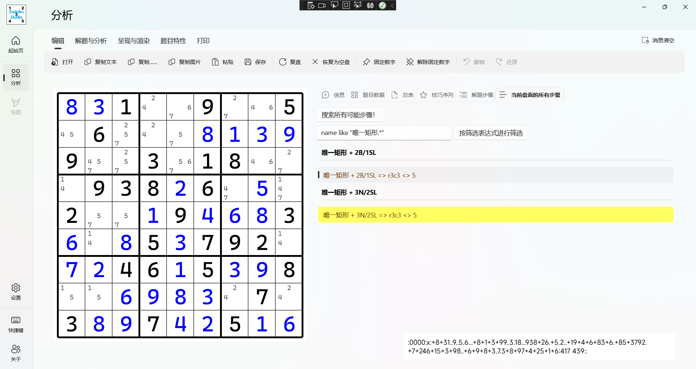

<center>语言切换：<a href="README-zh-cn.md">简体中文</a></center>

# Sunnie's Sudoku Solution

[](https://github.com/SunnieShine/Sudoku/stargazers)
[](https://github.com/SunnieShine/Sudoku/issues)
[](https://github.com/SunnieShine/Sudoku/blob/main/LICENSE)
[](https://github.com/badges/SunnieShine/Sudoku)


[-%230d1117)](https://github.com/SunnieShine/Sudoku/tree/main/src/Sudoku.UI)

[](https://github.com/SunnieShine/Sudoku)
[](https://gitee.com/SunnieShine/Sudoku)
[](https://sunnieshine.github.io/Sudoku/)

[](https://space.bilibili.com/23736703)

## Introduction

A sudoku handling SDK using brute forces and logical techniques. Now this solution supports generating puzzles, solving puzzles (with logical & illogical techniques) and some attribute checking (for example, to determine whether the specified grid is a minimal puzzle, which will become multiple solutions when any a digit is missing).

For example, you can use the code like this to solve a puzzle:

```csharp
using System;
using Sudoku.Collections;
using Sudoku.Solving.Manual;

// Parse a puzzle from the string text.
var grid = Grid.Parse("........6.....158...8.4.21.5..8..39.6.1.7.8.5.89..5..1.24.5.9...659.....9........");

// Declare a manual solver that uses techniques used by humans to solve a puzzle.
var solver = new ManualSolver();

// To solve a puzzle synchonously.
var analysisResult = solver.Solve(grid);

// You can also convert the type to 'ManualSolverResult'
// in order to check more data.
//var analysisResultConverted = (ManualSolverResult)analysisResult;

// Output the analysis result.
// You can also use 'ToString' instead of 'ToDisplayString'. They are same.
Console.WriteLine(analysisResult.ToDisplayString());
//Console.WriteLine(analysisResult.ToString()); // Same.
//Console.WriteLine(analysisResultConverted.ToDisplayString()); // Same.
//Console.WriteLine(analysisResultConverted.ToString()); // Same.
```

In the future, I'd like to apply this solution to **almost every platform**. I may finish the Win10 app project, android app project, bot on common online platforms (QQ, Bilibili and so on).

Please note that the programming language version is always used as 'preview', which means some preview features are still used in this solution.

You can also use JetBrains Rider as your IDE. Use whatever you want to use, even Notepad :D Although C# contains some syntaxes that are only allowed in Visual Studio (e.g. keyword `__makeref`), this repo doesn't use them. Therefore, you can use other IDEs to develop the code in this repo liberally.

In addition, the framework and IDE version may update in the future; in other words, they aren't changeless. The information is **for reference only**.

I don't use MVVM to design my UI project because I'm not familiar with it. If using as learning it, the development speed will be extremely slow.

## Prefaces

Command line:


UI:



The program is being under construction now!

## Forks & PRs (Pull Requests) for This Repo

Of course you can fork my repo and do whatever you want. You can do whatever you want to do under the [MIT license](https://github.com/SunnieShine/Sudoku/blob/main/LICENSE). However, due to the copy of the GitHub repo, Gitee repo doesn't support any PRs. I'm sorry. But you can create the issue on both two platforms. Please visit the following part "Basic Information" for learning about more details.

In addition, this repo may update **frequently** (At least 1 commit in a day).

## To-do List

* [x] API Implementation
  * [x] Data structures
  * [x] Generator (To generate sudokus)
  * [x] Solvers
    * [x] Human solving techniques
    * [x] Brute forces
* [ ] Wiki Documentation
  * [ ] Basic docs
  * [ ] Sudoku tutorial
* Solutions
  * [x] Console
  * [ ] User Interfaces
    * [ ] **Windows UI (I'm working on this)**
    * [ ] MAUI
  * [ ] Platform Bots
    * [ ] Bilibili
    * [ ] QQ
    * [ ] WeChat
* Miscellaneous
  * [ ] ~~Nuget packages~~ (Don't consider due to large modifications on APIs)
  * [ ] ~~Code analysis plug-ins~~ (Don't consider for same reason mentioned above)

> Some items aren't displayed because they are deprecated. In fact, the current repository did implement those like WPF. But now .NET has been updating very frequently, so I won't consider to maintain older frameworks of this repository, large complexity.

## Open Resource License

[MIT License](https://github.com/SunnieShine/Sudoku/blob/main/LICENSE)

## Sudoku Technique References

Here we list some websites about sudoku techniques that I used and referenced. The contents are constructed by myself, so if you want to learn more about sudoku techniques that this solution used and implemented, you can visit the following links to learn about more information. In Chinese.

* [标准数独技巧教程（视频）_bilibili](https://www.bilibili.com/video/BV1Mx411z7uq)
* [标准数独技巧教程（专栏）_bilibili](https://www.bilibili.com/read/readlist/rl291187)

## Author

Sunnie, from Chengdu, is a normal undergraduate from Sichuan Normal University. I mean, a normal university (Pun)

